---

# GreyMatter Programming Language

GreyMatter is an experimental programming language developed in Python with the goal of helping students and developers understand how programming languages work internally. The language demonstrates fundamental concepts behind interpreters, lexical analysis, parsing, syntax evaluation, and runtime execution.

<p align="center">
  
</p>

Unlike production programming languages that prioritize performance and large ecosystems, GreyMatter focuses on simplicity, experimentation, and educational exploration. The syntax is intentionally designed to be simple and expressive so that beginners can easily understand how a custom programming language behaves.

GreyMatter includes many core programming constructs such as variables, arithmetic operations, conditionals, loops, functions, and built-in utilities. The interpreter processes user code through several internal steps including tokenization, parsing, abstract syntax tree construction, and execution.

The project is implemented in Python and uses **SLY** for building the lexer and parser components of the interpreter.

GreyMatter is primarily intended for:

* Learning programming language design
* Understanding interpreter development
* Exploring syntax parsing techniques
* Experimenting with custom programming languages
* Educational demonstrations for computer science students

---

# Inspiration

The concept and name of GreyMatter were inspired by the highly intelligent alien **Grey Matter** from the animated television series **Ben 10**.

In the Ben 10 universe, Grey Matter represents intelligence, analytical thinking, and problem solving. This programming language was created with a similar philosophy: encouraging logical thinking and experimentation through programming.

Many built-in functions in the GreyMatter language are named after **alien characters and abilities from the Ben 10 universe**. These names symbolize the different abilities and operations the language can perform.

---

# Project Objectives

The GreyMatter project was designed with the following goals:

• Demonstrate how programming languages are implemented
• Provide an educational interpreter written in Python
• Help students learn parsing and syntax evaluation
• Encourage experimentation with programming language design
• Combine creativity with programming concepts

---

# Technology Stack

GreyMatter is implemented using the following technologies:

| Technology              | Purpose                         |
| ----------------------- | ------------------------------- |
| Python                  | Core interpreter implementation |
| SLY                     | Lexer and parser construction   |
| AST Model               | Program execution structure     |
| Python Standard Library | Utility functions               |

---

# Core Language Features

GreyMatter includes the following features:

* Dynamic variables
* Arithmetic expressions
* Conditional logic
* Logical operators
* Loop structures
* User-defined functions
* Built-in utility functions
* String manipulation
* Time utilities
* Memory storage utilities
* Experimental web and AI query features

---

# Basic Program Example

```python
x = 10
y = 20

z = x + y

PRINT(z)
```

Output

```
30
```

---

# Variables

Variables in GreyMatter are dynamically typed. They are automatically created when a value is assigned.

Example

```python
name = "Abinesh"
age = 21
score = 95
```

Example program

```python
name = INPUT("Enter your name: ")
PRINT("Hello", name)
```

---

# Arithmetic Operations

GreyMatter supports basic mathematical operations.

| Operator | Description    |
| -------- | -------------- |
| +        | Addition       |
| -        | Subtraction    |
| *        | Multiplication |
| /        | Division       |
| %        | Modulus        |

Example

```python
x = 10
y = 3

PRINT(x + y)
PRINT(x - y)
PRINT(x * y)
PRINT(x / y)
PRINT(x % y)
```

Output

```
13
7
30
3.33
1
```

---

# Increment and Decrement

GreyMatter allows increment and decrement operators.

Example

```python
x = 5
x++
PRINT(x)
```

Output

```
6
```

Example

```python
x = 10
x--
PRINT(x)
```

Output

```
9
```

---

# Compound Assignment

Compound assignments simplify arithmetic updates.

Example

```python
x = 10

x += 5
PRINT(x)
```

Output

```
15
```

Other operators

```python
x -= 3
x *= 2
x /= 4
x %= 3
```

---

# Input and Output Functions

---

# PRINT()

The PRINT function displays output to the console.

Example

```python
PRINT("Welcome to GreyMatter")
```

Example with variables

```python
name = "Developer"
PRINT("Hello", name)
```

Output

```
Hello Developer
```

---

# INPUT()

INPUT reads text input from the user.

Example

```python
name = INPUT("Enter your name: ")
PRINT(name)
```

---

# INT()

Converts a value to an integer.

Example

```python
age = INT(INPUT("Enter your age: "))
PRINT(age)
```

---

# STR()

Converts a value to a string.

Example

```python
number = 100
text = STR(number)
PRINT(text)
```

---

# Conditional Statements

GreyMatter supports conditional logic using IF and ELSE.

Example

```python
age = INT(INPUT("Enter age: "))

IF(age >= 18){

   PRINT("Eligible to vote")

}
ELSE{

   PRINT("Not eligible")

}
```

---

# Comparison Operators

| Operator | Description           |
| -------- | --------------------- |
| ==       | Equal                 |
| !=       | Not Equal             |
| >        | Greater Than          |
| <        | Less Than             |
| >=       | Greater Than or Equal |
| <=       | Less Than or Equal    |

Example

```python
x = 10
y = 5

IF(x > y){

   PRINT("x is greater")

}
```

---

# Logical Operators

| Operator | Meaning     |
| -------- | ----------- |
| AND      | Logical AND |
| OR       | Logical OR  |

Example

```python
x = 10
y = 20

IF(x > 5 AND y < 30){

   PRINT("Condition satisfied")

}
```

---

# Loops

---

# WHILE Loop

Example

```python
x = 1

WHILE(x <= 5){

   PRINT(x)
   x++

}
```

Output

```
1
2
3
4
5
```

---

# FOR Loop

Example

```python
FOR(i = 0 ; i <= 5 ; i++){

   PRINT(i)

}
```

---

Short loop example

```python
FOR(3){

   PRINT("GreyMatter")

}
```

Output

```
GreyMatter
GreyMatter
GreyMatter
```

---

# Functions

Functions allow code reuse.

Example

```python
FUNCTION add(x,y){

   result = x + y
   FEEDBACK(result)

}
```

Calling function

```python
sum = add(5,6)
PRINT(sum)
```

Output

```
11
```

---

# FEEDBACK Statement

FEEDBACK returns values from functions.

Example

```python
FUNCTION square(x){

   FEEDBACK(x*x)

}
```

Example call

```python
PRINT(square(4))
```

Output

```
16
```

---

# Built-in Utility Functions

Many functions in GreyMatter are named after alien abilities from the **Ben 10 universe**.

---

# ECHO

Prints a blank line.

Example

```python
PRINT("Hello")
ECHO
PRINT("World")
```

---

# ECHOECHO

Prints multiple blank lines.

Example

```python
PRINT("Start")
ECHOECHO
PRINT("End")
```

---

# LEN()

Returns length of a string.

Example

```python
text = "GreyMatter"
PRINT(LEN(text))
```

Output

```
10
```

---

# FASTTRACK()

Returns character at a given index.

Example

```python
word = "hello"
PRINT(word.FASTTRACK(1))
```

Output

```
e
```

---

# WAYBIG()

Converts text to uppercase.

Example

```python
text = "hello"
PRINT(text.WAYBIG())
```

Output

```
HELLO
```

---

# NANOMECH()

Converts text to lowercase.

Example

```python
text = "HELLO"
PRINT(text.NANOMECH())
```

Output

```
hello
```

---

# ISWAYBIG()

Checks whether text is uppercase.

Example

```python
text = "HELLO"

PRINT(text.ISWAYBIG())
```

Output

```
True
```

---

# ISNANOMECH()

Checks whether text is lowercase.

Example

```python
text = "hello"

PRINT(text.ISNANOMECH())
```

Output

```
True
```

---

# PARADOX Time Utilities

---

# PARADOX.SLEEP()

Pauses program execution.

Example

```python
PRINT("Start")
PARADOX.SLEEP(3)
PRINT("End")
```

---

# PARADOX.UNITIME()

Returns system time.

Example

```python
PRINT(PARADOX.UNITIME())
```

---

# PARADOX.UNIDATE()

Returns system date.

Example

```python
PRINT(PARADOX.UNIDATE())
```

---

# BRAINSTORM Memory System

BRAINSTORM is a simple data storage system inside GreyMatter.

---

# BRAINSTORM.READ()

Stores value in memory.

Example

```python
BRAINSTORM.READ(10)
BRAINSTORM.READ(20)
```

---

# BRAINSTORM.WRITE()

Writes value to memory.

Example

```python
BRAINSTORM.WRITE(x)
```

---

# BRAINSTORM.GET()

Retrieves stored data.

Example

```python
BRAINSTORM.GET()
```

---

# JETRAY()

Executes fast interpreter commands.

Example

```python
JETRAY("system_task")
```

---

# Web Search Feature

Example

```python
PRINT(@WEB_SEARCH "Python programming language")
```

---

# AI Query Feature

Example

```python
PRINT(@AI "Explain machine learning")
```

---

# BREAK Statement

Stops loop execution.

Example

```python
WHILE(1){

   PRINT("Running")

   BREAK

}
```

---

# Comments

GreyMatter supports two comment formats.

Example

```python
# this is a comment #
```

Example

```python
// this is another comment //
```

---

# Complete Built-in Function Table

| Function           | Description            | Example              |
| ------------------ | ---------------------- | -------------------- |
| PRINT()            | Display output         | PRINT("Hello")       |
| INPUT()            | Get user input         | name = INPUT("Name") |
| INT()              | Convert to integer     | age = INT(INPUT())   |
| STR()              | Convert to string      | STR(100)             |
| LEN()              | Get string length      | LEN("hello")         |
| FASTTRACK()        | Character index access | word.FASTTRACK(1)    |
| WAYBIG()           | Convert to uppercase   | text.WAYBIG()        |
| NANOMECH()         | Convert to lowercase   | text.NANOMECH()      |
| ISWAYBIG()         | Check uppercase        | text.ISWAYBIG()      |
| ISNANOMECH()       | Check lowercase        | text.ISNANOMECH()    |
| ECHO               | Blank line             | ECHO                 |
| ECHOECHO           | Multiple blank lines   | ECHOECHO             |
| PARADOX.SLEEP()    | Pause program          | PARADOX.SLEEP(5)     |
| PARADOX.UNITIME()  | Get system time        | PARADOX.UNITIME()    |
| PARADOX.UNIDATE()  | Get system date        | PARADOX.UNIDATE()    |
| BRAINSTORM.READ()  | Store value            | BRAINSTORM.READ(x)   |
| BRAINSTORM.WRITE() | Write memory value     | BRAINSTORM.WRITE(x)  |
| BRAINSTORM.GET()   | Retrieve stored values | BRAINSTORM.GET()     |
| JETRAY()           | Execute fast operation | JETRAY(cmd)          |
| @WEB_SEARCH        | Web search query       | @WEB_SEARCH "Python" |
| @AI                | AI query system        | @AI "Explain AI"     |
| BREAK              | Exit loop              | BREAK                |
| FUNCTION           | Define function        | FUNCTION add(x,y)    |
| FEEDBACK           | Return value           | FEEDBACK(x+y)        |

---

# Interpreter Architecture

GreyMatter follows a traditional interpreter architecture:

1. Lexical Analysis (Tokenization)
2. Syntax Parsing
3. Abstract Syntax Tree (AST) Generation
4. Runtime Execution Engine

This architecture allows the interpreter to process and execute GreyMatter programs dynamically.

---

# Educational Benefits

GreyMatter helps developers learn:

* Programming language design
* Interpreter construction
* Parsing techniques
* Runtime evaluation
* Custom language experimentation

---

# Author

Abinesh N

GitHub
[https://github.com/Abineshabee](https://github.com/Abineshabee)

---
## License

This project is licensed under the [GNU General Public License v3.0](LICENSE) - see the [LICENSE](LICENSE) file for details.
---
